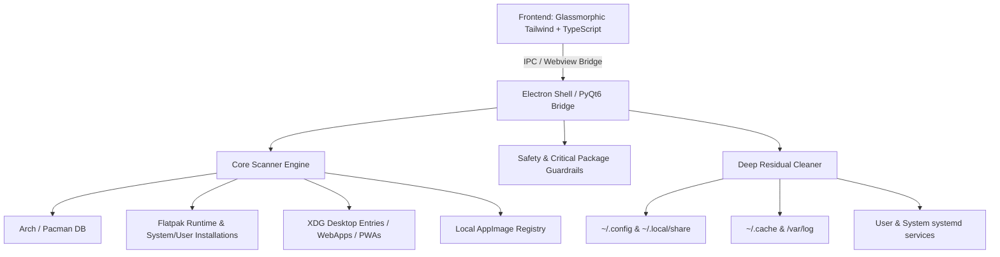

# 🚀 Ultimate Linux App Manager (XENO Uninstaller)

> **Ultra-Modern, Glassmorphic Linux Package Manager, Dependency Intelligence Utility & Forensic Software Uninstaller**


---

## 📥 Download Standalone .AppImage (v1.0.0)

[](https://github.com/imObito/ultimate-linux-app-manager/releases/download/v1.0.0/Ultimate-Linux-App-Manager-1.0.0.AppImage)

```bash
# Make executable and launch immediately:
chmod +x Ultimate-Linux-App-Manager-1.0.0.AppImage
./Ultimate-Linux-App-Manager-1.0.0.AppImage
```

---

## 🌟 Overview

**Ultimate Linux App Manager** is an elite desktop software management suite designed to replace archaic Linux package managers with a cutting-edge, hardware-accelerated, and visually stunning user experience. Built with a bespoke **Apple/Vercel/Linear-grade glassmorphism design system**, it unifies discovery, forensic inspection, dependency telemetry, residual filesystem cleanup, and multi-theme customization across all Linux packaging formats.

---

## ✨ Key Features

### 💎 Elite Tabbed Navigation & Glassmorphic Dashboard
- **Top Tab Bar**: Instant switching between `[ 📦 Applications ]`, `[ 🧹 System Cleaner ]`, `[ ⚙️ Settings & Themes ]`, and `[ ℹ️ About ]`.
- **Top Quick Tip Banner**: Helpful dismissible guides and quick-start hints.
- **Multi-Theme Engine**: 4 interactive themes with persistent local storage:
  1. *Obsidian Onyx* (Apple/Vercel deep space)
  2. *Cyber Emerald* (Matrix Neon green)
  3. *Neon Cyberpunk* (Violet glow)
  4. *Titanium Ice* (Deep blue / cyan)
- **Categorized App Deck**: Clean grouped sections for **Gaming & Emulators**, **Flatpak Applications**, **System Packages (Pacman)**, and **WebApps & PWAs** with badge counters, custom app registration, and folder scanners.
- **Slide-out Forensic Telemetry Sheet**: Real SVG circular gauges, memory/disk footprint progress bars, deep residual directory audits, and dependency trees.

### 🔍 Spotlight Global Search (`⌘K` / `Ctrl+K`)
- Instant fuzzy search across thousands of system packages.
- Smooth backdrop blur dimming (`backdrop-filter: blur(8px)`) with instant keyboard navigation and status tags.

### 🛡️ Forensic Safety Engine & Zero-Residual Uninstallation
- **System-Critical Shield**: Built-in protection blacklist safeguarding core system components (`linux`, `glibc`, `systemd`, `wayland`, `pipewire`, `pacman`, etc.).
- **Residual File Cleanup**: Deep simulation and detection of lingering configuration files, cache directories, and log sinks left behind by standard package uninstallers.
- **Root Elevation & Sandbox Awareness**: Secure PKEXEC/Sudo wrappers and native Flatpak CLI integrations (`flatpak uninstall --delete-data`).

### 🌌 Ambient Visual Immersion
- Hardware-accelerated ambient glowing mesh backdrop with GPU rasterization flags enabled.
- Ultra-subtle radial gradient illumination with multi-layered specular borders (`rgba(255, 255, 255, 0.07)`).

---

## 🏗️ System Architecture



---

## 🛠️ Local Developer Setup & Execution

### Prerequisites
- **Node.js**: v18+ (Node v20+ recommended)
- **Linux Environment**: Arch Linux / CachyOS / Ubuntu / Fedora
- **Optional**: Python 3.10+ with `PyQt6` and `PyQt6-WebEngine` for the Python native runner.

### 1. Clone the Repository
```bash
git clone https://github.com/skthenawab/ultimate-linux-app-manager.git
cd ultimate-linux-app-manager
```

### 2. Install Dependencies
```bash
npm install
```

### 3. Launch the Electron Desktop Application
```bash
npm start
```

### 4. Development & Hot Reload (Vite Web Mode)
To run the frontend under Vite's live development server:
```bash
npm run dev
```

### 5. Native PyQt6 Desktop Wrapper
Alternatively, launch via the native Python/Qt6 engine:
```bash
chmod +x run.sh
./run.sh
```

---

## 📦 Directory Structure

```
├── app-uninstaller.desktop   # Linux desktop integration launcher
├── main.js                   # Electron hardware-accelerated window runner
├── preload.cjs               # Electron IPC security bridge
├── package.json              # Node dependencies and build scripts
├── tailwind.config.js        # Custom Tailwind v4 styling and neon palette
├── staging/                  # Production-ready compiled web bundle
│   ├── index.html            # Main interface markup
│   ├── styles.css            # Glassmorphic CSS engine & animations
│   └── app.js                # Core UI logic, telemetry & icons
├── ui/                       # Source TypeScript/Vite application
│   ├── src/
│   │   ├── design/           # Design system tokens, CSS, vector icons
│   │   └── main.ts           # Frontend application state & handlers
├── core/                     # Python package discovery & scanner engines
└── tests/                    # Automated unit & integration tests
```

---

## 📄 License
Distributed under the **GPL-3.0 License**. See `LICENSE` for more information.
